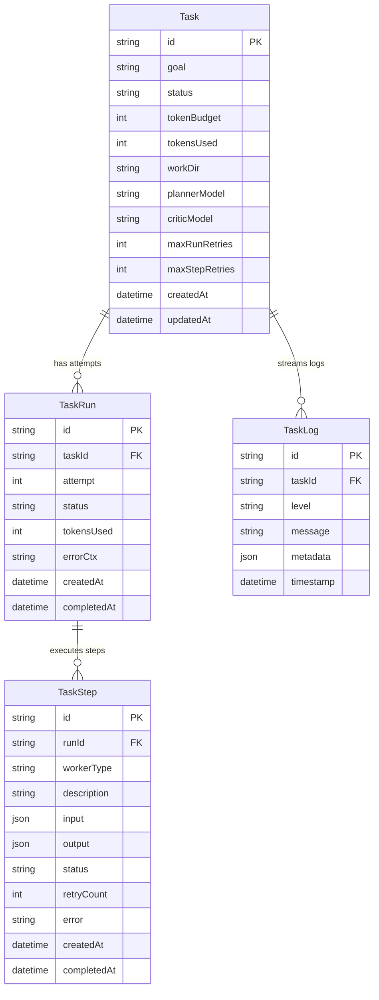
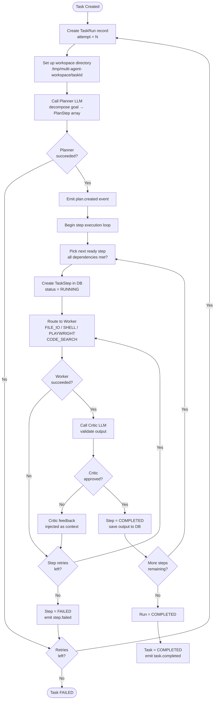
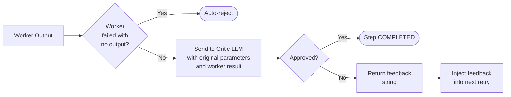
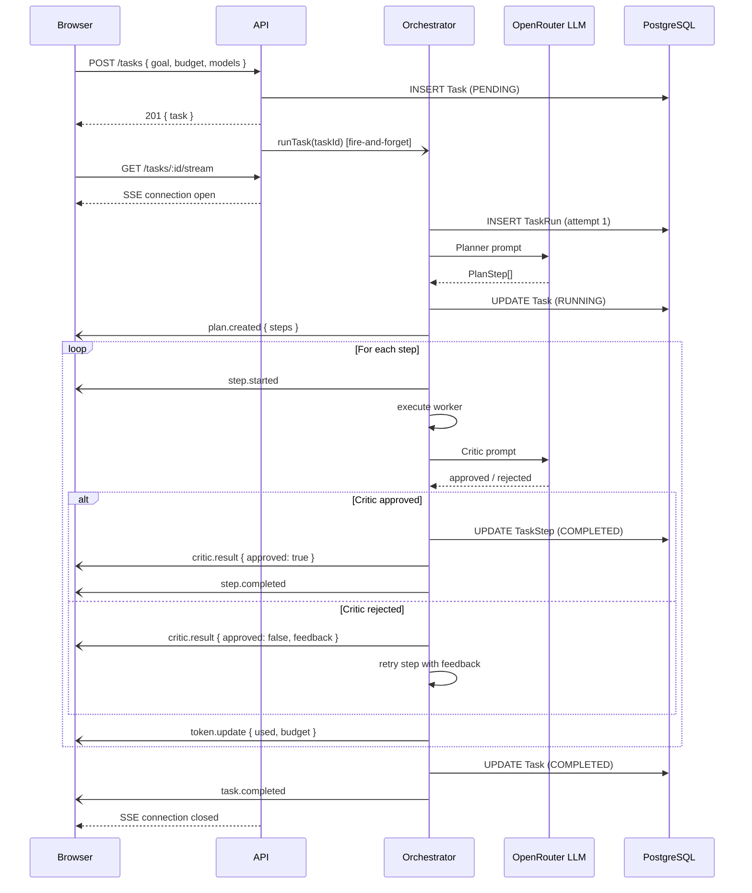

# Multi-Agent

An autonomous multi-agent engineering system that accepts a natural-language goal, decomposes it into a step-by-step plan, executes each step with specialized workers, validates the output with a Critic LLM, and streams every event back to the browser in real time.

---

## Table of Contents

1. [Overview](#overview)
2. [Architecture](#architecture)
3. [Repository Layout](#repository-layout)
4. [Data Model](#data-model)
5. [Agent System Deep-Dive](#agent-system-deep-dive)
   - [Orchestrator](#orchestrator)
   - [Planner](#planner)
   - [Critic](#critic)
   - [Workers](#workers)
6. [API Reference](#api-reference)
7. [Frontend](#frontend)
8. [Real-Time Event Stream](#real-time-event-stream)
9. [Token Budget](#token-budget)
10. [Environment Variables](#environment-variables)
11. [Local Development](#local-development)
12. [Database Management](#database-management)
13. [Deployment](#deployment)
14. [Tech Stack](#tech-stack)

---

## Overview

Multi-Agent is a full-stack application that lets you hand a high-level goal to an AI system and watch it autonomously plan and execute a series of steps to accomplish that goal. Think of it as a self-directing engineer: it figures out what needs to happen, does the work, checks its own output, and retries when something goes wrong — all while you follow along live in the browser.

**What it can do**

| Capability | How |
|---|---|
| Browse the web | Playwright headless Chrome |
| Read & write files | Sandboxed file worker |
| Run shell commands | Sandboxed shell worker |
| Search code | ripgrep / Node.js fallback |
| Self-correct | Critic LLM rejects bad output → worker retries |
| Stay within budget | Hard token budget with live gauge |
| Stream everything | Server-Sent Events to the browser |

---

## Architecture

The system is split into three layers that communicate through a shared type package and a PostgreSQL database.

```
┌─────────────────────────────────────────────────────────────────────┐
│                          Browser (Next.js 14)                        │
│                                                                       │
│   ┌──────────────┐   ┌─────────────────┐   ┌──────────────────────┐ │
│   │  Task List   │   │  Task Detail    │   │   Task Form          │ │
│   │  (polling)   │   │  (SSE stream)   │   │   (model picker)     │ │
│   └──────┬───────┘   └────────┬────────┘   └──────────┬───────────┘ │
└──────────┼────────────────────┼────────────────────────┼─────────────┘
           │  REST              │  SSE                   │  REST POST
           ▼                    ▼                        ▼
┌──────────────────────────────────────────────────────────────────────┐
│                      Fastify API  (Node.js)                           │
│                                                                        │
│  ┌──────────────┐  ┌──────────────────────────────────────────────┐  │
│  │  HTTP Routes │  │              Orchestrator                     │  │
│  │  /tasks      │  │                                               │  │
│  │  /models     │  │  ┌──────────┐  ┌────────────────────────┐   │  │
│  │  /stream     │  │  │ Planner  │  │  Step Execution Loop   │   │  │
│  │  /files      │  │  │  (LLM)   │  │  ┌──────┐ ┌────────┐  │   │  │
│  └──────────────┘  │  └──────────┘  │  │Worker│ │Critic  │  │   │  │
│                    │                │  └──────┘ └────────┘  │   │  │
│  ┌─────────────┐   │  ┌──────────┐  └────────────────────────┘   │  │
│  │  Event Bus  │◄──┤  │ Token    │                                │  │
│  │ (EventEmit) │   │  │ Budget   │                                │  │
│  └─────────────┘   │  └──────────┘                               │  │
│                    └──────────────────────────────────────────────┘  │
│                                                                        │
│  ┌────────────────────────────────────────────────────────────────┐  │
│  │                  Workers                                        │  │
│  │  ┌──────────┐ ┌──────────┐ ┌────────────┐ ┌────────────────┐  │  │
│  │  │  File IO │ │  Shell   │ │ Playwright │ │  Code Search   │  │  │
│  │  └──────────┘ └──────────┘ └────────────┘ └────────────────┘  │  │
│  └────────────────────────────────────────────────────────────────┘  │
└────────────────────────────────────────────────────────────────────────┘
           │
           ▼
┌──────────────────────┐       ┌──────────────────────┐
│  PostgreSQL (Neon)   │       │  OpenRouter (LLMs)   │
│  Tasks / Runs /      │       │  Planner + Critic    │
│  Steps / Logs        │       │  (any model)         │
└──────────────────────┘       └──────────────────────┘
```

---

## Repository Layout

```
multi-agent/
├── apps/
│   ├── api/                    # Fastify backend
│   │   ├── prisma/
│   │   │   └── schema.prisma   # Database schema
│   │   └── src/
│   │       ├── index.ts        # Server entry point
│   │       ├── db/
│   │       │   └── client.ts   # Prisma singleton
│   │       ├── routes/
│   │       │   └── tasks.ts    # All HTTP + SSE routes
│   │       ├── services/
│   │       │   ├── orchestrator.ts   # Main execution engine
│   │       │   ├── event-bus.ts      # In-process pub/sub
│   │       │   └── token-budget.ts   # Token accounting
│   │       └── agents/
│   │           ├── planner.ts        # LLM → PlanStep[]
│   │           ├── critic.ts         # LLM output validator
│   │           └── workers/
│   │               ├── base.ts
│   │               ├── file.worker.ts
│   │               ├── shell.worker.ts
│   │               ├── playwright.worker.ts
│   │               └── code-search.worker.ts
│   └── web/                    # Next.js 14 frontend
│       └── src/
│           ├── app/
│           │   ├── layout.tsx
│           │   ├── page.tsx            # Task list (home)
│           │   └── tasks/[id]/page.tsx # Task detail
│           ├── components/
│           │   ├── TaskForm.tsx
│           │   ├── TaskRow.tsx
│           │   ├── StepList.tsx
│           │   ├── LogStream.tsx
│           │   ├── FilesBrowser.tsx
│           │   ├── TokenGauge.tsx
│           │   ├── ModelPicker.tsx
│           │   └── StatusBadge.tsx
│           └── lib/
│               ├── api.ts      # API client helpers
│               ├── sse.ts      # useSSE hook
│               └── cn.ts       # Tailwind class merge
└── packages/
    └── shared/                 # Shared TypeScript types & Zod schemas
        └── src/
            ├── types.ts
            └── schemas.ts
```

---

## Data Model

Every task flows through four database tables. The diagram below shows their relationships and the lifecycle states each entity moves through.



### Task Status Lifecycle

```
PENDING ──► RUNNING ──► COMPLETED
                  │
                  ├──► FAILED
                  │
                  └──► CANCELLED
```

### TaskRun Status Lifecycle

```
PENDING ──► RUNNING ──► COMPLETED
                  │
                  └──► FAILED  (triggers next attempt, up to maxRunRetries)
```

### TaskStep Status Lifecycle

```
PENDING ──► RUNNING ──► COMPLETED
                  │
                  └──► FAILED  (Critic rejected, up to maxStepRetries)
```

---

## Agent System Deep-Dive

### Orchestrator

The orchestrator is the central execution engine. It lives in `apps/api/src/services/orchestrator.ts` and drives the entire lifecycle of a task from start to finish.



### Planner

The Planner (`apps/api/src/agents/planner.ts`) is an LLM call (via OpenRouter) that converts a free-text goal into a structured `PlanStep[]` array using OpenAI-style function calling.

**What the Planner outputs**

```typescript
interface PlanStep {
  id: string;            // e.g. "step_1"
  workerType: WorkerType;
  description: string;   // human-readable intent
  parameters: Record<string, unknown>;  // worker-specific config
  dependencies: string[]; // ids of steps that must complete first
}
```

**Retry behaviour** — If the previous run failed, the Planner receives the error context from that run so it can adjust the plan. Rate-limit responses (HTTP 429) trigger exponential backoff before retrying.

**Dependency graph** — Steps can declare dependencies on other steps. The orchestrator resolves these so independent steps can run in parallel.

```
Example plan for "scrape HN front page and save to file":

step_1 (PLAYWRIGHT)  ──────────────────────────────────►  step_2 (FILE_IO)
  action: scrape                                              action: write
  url: https://news.ycombinator.com                          file: hn.json
                                                             content: <step_1.data>
  no dependencies                                            dependencies: [step_1]
```

### Critic

The Critic (`apps/api/src/agents/critic.ts`) is a second LLM call that inspects a worker's output and decides whether it is valid and useful.



**Special rule for web scraping** — Since scraped content changes over time and cannot be deterministically verified, the Critic automatically approves a Playwright scrape result as long as it returned at least one element.

### Workers

Each worker is a TypeScript class extending `BaseWorker`. All workers receive the task's `workDir` as a security boundary — they cannot access paths outside it.

#### File Worker

Handles all filesystem operations within the workspace.

| Operation | Description |
|---|---|
| `read` | Read file contents as string |
| `write` | Write/overwrite a file |
| `append` | Append text to a file |
| `delete` | Remove a file |
| `list` | List all files in a directory |
| `exists` | Check whether a path exists |
| `copy` | Copy one file to another path |

#### Shell Worker

Executes shell commands inside the workspace directory.

```
Parameters:
  command  : string   — the shell command to run
  timeout  : number   — max seconds (60–180, default 60)

Security:
  - Blocks: rm -rf /, mkfs, chmod 777 /
  - Windows: multi-line scripts → temp .bat; heredocs → temp .js
  - Env: MULTI_AGENT_WORK_DIR and TASK_ID are injected
```

#### Playwright Worker

Drives a headless Chrome browser. A single browser instance is reused across all tasks to reduce startup overhead.

| Action | Description |
|---|---|
| `scrape` | Extract all visible text from a URL |
| `screenshot` | Capture a PNG and save to workspace |
| `click` | Click a CSS selector |
| `fill` | Type into an input |
| `navigate` | Go to a URL |
| `extract` | Extract text from a specific selector |
| `links` | Get all `<a>` href values on a page |

Anti-bot configuration: hides `navigator.webdriver`, spoofs `navigator.plugins` and `navigator.languages`, sets a realistic User-Agent.

#### Code Search Worker

Searches source code inside the workspace.

```
Parameters:
  pattern      : string   — regex or literal search term
  caseSensitive: boolean  — default false
  filePattern  : string   — glob filter (e.g. "*.ts")
  maxResults   : number   — default 50

Returns: Array of { file, line, content }
```

Uses `ripgrep` when available; falls back to a Node.js recursive file walk.

---

## API Reference

All routes are mounted on the Fastify server (default port `3001`). The Next.js frontend proxies `/api/*` to this server.

### `GET /health`
Returns `{ ok: true }`. Used by Vercel and uptime monitors.

---

### `GET /models`
Returns the list of models available on OpenRouter. Response is cached for 5 minutes.

---

### `POST /tasks`
Create a new task and begin execution immediately (fire-and-forget).

**Request body**
```json
{
  "goal": "Scrape the Hacker News front page and save the top 10 links to a JSON file",
  "tokenBudget": 100000,
  "maxRunRetries": 2,
  "maxStepRetries": 2,
  "plannerModel": "openai/gpt-4o",
  "criticModel": "openai/gpt-4o-mini"
}
```

| Field | Type | Default | Constraints |
|---|---|---|---|
| `goal` | string | — | 10–2000 chars, required |
| `tokenBudget` | number | 100 000 | 10 000–500 000 |
| `maxRunRetries` | number | 2 | 0–5 |
| `maxStepRetries` | number | 2 | 0–3 |
| `plannerModel` | string | (best free) | valid OpenRouter model ID |
| `criticModel` | string | (best free) | valid OpenRouter model ID |

**Response** — the created `Task` object.

---

### `GET /tasks`
Returns the 50 most recent tasks, newest first. Each task includes its latest `TaskRun` and that run's `TaskStep` array.

---

### `GET /tasks/:id`
Full task detail: all runs, all steps for each run, and all logs.

---

### `PATCH /tasks/:id/cancel`
Cancels a running task. Sets status to `CANCELLED` and emits a cancellation event so the SSE stream closes.

---

### `DELETE /tasks/:id`
Deletes the task and all child records (logs → steps → runs → task).

---

### `GET /tasks/:id/stream`
Server-Sent Events stream. Opens an `EventSource`-compatible connection that emits `AgentEvent` objects as JSON.

See [Real-Time Event Stream](#real-time-event-stream) for the full event reference.

---

### `GET /tasks/:id/files`
Lists all files in the task's workspace directory. Filters out `node_modules`, `.git`, and binary build artifacts.

**Response**
```json
[
  { "name": "hn.json", "path": "hn.json", "size": 4096, "modified": "2024-01-01T00:00:00Z" }
]
```

---

### `GET /tasks/:id/files/*`
Downloads or previews a single file from the workspace. Path traversal outside `workDir` is rejected with `403`. Content-Type is auto-detected (images, JSON, plain text, etc.).

---

### `GET /tasks/:id/logs`
Paginated log retrieval (REST fallback for the SSE stream).

Query params: `limit` (default 100), `offset` (default 0).

---

## Frontend

### Pages

#### Home — `/`

```
┌─────────────────────────────────────────────────────────┐
│  Multi-Agent              [+ New Task]                   │
├─────────────────────────────────────────────────────────┤
│  Stats: ● Running: 1   ✓ Completed: 12   ✗ Failed: 2   │
├─────────────────────────────────────────────────────────┤
│  ● RUNNING   Scrape HN and save top links...             │
│              2 min ago  ██████░░░░  4/7 steps  gpt-4o   │
├─────────────────────────────────────────────────────────┤
│  ✓ COMPLETED Create a Python CLI tool...                 │
│              1 hour ago ██████████ 6/6 steps  gpt-4o    │
└─────────────────────────────────────────────────────────┘
```

Polls `/tasks` every 4 seconds. Clicking a row navigates to the detail page. The delete button appears on hover (disabled while the task is running).

---

#### Task Detail — `/tasks/[id]`

```
┌────────────────────────────────┬────────────────────────────────┐
│  LEFT PANEL                    │  RIGHT PANEL                    │
│                                │                                 │
│  Goal: "Scrape HN and save..." │  [Logs]  [Files]               │
│  Status: ● RUNNING             │                                 │
│  Attempt: 1 of 3               │  12:01:05  INFO  Planner       │
│  Model: gpt-4o / gpt-4o-mini   │            created 3-step plan │
│                                │  12:01:06  INFO  Step 1 start  │
│  Token Gauge                   │  12:01:08  INFO  Playwright ok  │
│  ████████░░  82 400 / 100 000  │  12:01:08  INFO  Critic approved│
│                                │  12:01:09  INFO  Step 2 start  │
│  Step Pipeline                 │  ...                           │
│  ✓ PLAYWRIGHT  Scrape HN       │                                 │
│  ● RUNNING    Write JSON file  │                                 │
│  ○ PENDING    Summarise        │                                 │
└────────────────────────────────┴────────────────────────────────┘
```

The right panel's **Logs** tab streams events live over SSE. The **Files** tab auto-refreshes every 4 seconds while the task is running, letting you watch output files appear as they are created.

---

### Components

| Component | Responsibility |
|---|---|
| `TaskForm` | Modal to create a new task; model picker pre-selects the best free model |
| `TaskRow` | Single row in the task list with status dot, step progress bar, model label |
| `StepList` | Visual pipeline timeline with worker icons, animated connectors, error details |
| `LogStream` | Auto-scrolling monospace log view, colour-coded by level |
| `FilesBrowser` | Workspace file list with inline preview (images) and text modal |
| `TokenGauge` | Radial bar chart showing tokens used / budget (blue → amber → red) |
| `ModelPicker` | Dropdown populated from `/models`; auto-selects best free model |
| `StatusBadge` | Coloured pill for task / step status |

---

## Real-Time Event Stream

The SSE endpoint at `GET /tasks/:id/stream` emits newline-delimited JSON. The `useSSE` hook (`apps/web/src/lib/sse.ts`) connects `EventSource`, parses each message, and auto-reconnects after 3 seconds if the connection drops.

### Event Types

```typescript
type AgentEvent =
  | { type: "plan.created";    steps: PlanStep[] }
  | { type: "step.started";    stepId: string; workerType: WorkerType; description: string }
  | { type: "step.completed";  stepId: string; summary: string }
  | { type: "step.failed";     stepId: string; error: string; retryCount: number }
  | { type: "critic.result";   stepId: string; approved: boolean; feedback?: string }
  | { type: "token.update";    used: number; budget: number }
  | { type: "log";             level: LogLevel; message: string; metadata?: unknown }
  | { type: "task.completed";  taskId: string }
  | { type: "task.failed";     taskId: string; error: string }
  | { type: "task.cancelled";  taskId: string }
  | { type: "error";           message: string }
  | { type: "heartbeat" }
```

### Event Flow Diagram



---

## Token Budget

Every task has a hard token budget (default: 100 000 tokens). The `TokenBudget` service (`apps/api/src/services/token-budget.ts`) tracks consumption across all LLM calls (Planner + Critic) and fires a callback on each update so the SSE stream can push `token.update` events to the browser in real time.

If the budget is exhausted mid-task, a `TokenBudgetExhaustedError` is thrown. The orchestrator catches this, marks the task `FAILED`, and stops retrying — regardless of how many run retries remain.

**Token gauge colour thresholds**

```
0% ──────────── 60% ─────────── 85% ─────────── 100%
     blue (safe)       amber (caution)    red (critical)
```

---

## Environment Variables

Create a `.env` file in the repo root (or in `apps/api/` for the server only).

| Variable | Required | Default | Description |
|---|---|---|---|
| `DATABASE_URL` | Yes | — | Neon PostgreSQL connection string |
| `OPENROUTER_API_KEY` | Yes | — | API key from openrouter.ai |
| `PORT` | No | `3001` | API server port |
| `HOST` | No | `0.0.0.0` | API server bind address |
| `NODE_ENV` | No | `development` | `development` or `production` |
| `CORS_ORIGIN` | No | `http://localhost:3000` | Allowed frontend origin |
| `NEXT_PUBLIC_API_URL` | No | `http://localhost:3001` | API base URL (used by Next.js frontend) |
| `APP_URL` | No | `http://localhost:3000` | Sent as `HTTP-Referer` to OpenRouter |

---

## Local Development

### Prerequisites

- Node.js 20+
- npm 10+
- A [Neon](https://neon.tech) PostgreSQL database (free tier works)
- An [OpenRouter](https://openrouter.ai) API key

### Steps

```bash
# 1. Clone the repo
git clone https://github.com/vkxr/multi-agent.git
cd multi-agent

# 2. Install all workspace dependencies
npm install

# 3. Copy the example env file and fill in your values
cp .env.example .env
# edit .env — set DATABASE_URL and OPENROUTER_API_KEY

# 4. Push the Prisma schema to your database
npm run db:push

# 5. Start both the API and the web app in parallel
npm run dev
```

| Service | URL |
|---|---|
| Web frontend | http://localhost:3000 |
| API server | http://localhost:3001 |
| Health check | http://localhost:3001/health |

The API and web app are started concurrently via `concurrently`, with log prefixes `API` (magenta) and `WEB` (cyan) so you can tell them apart in the terminal.

---

## Database Management

```bash
# Push schema changes directly (no migration history)
npm run db:push

# Create a new migration file
npm run db:migrate

# Open Prisma Studio GUI (browser-based table viewer)
npm run db:studio
```

All three commands are thin wrappers around the `apps/api` workspace scripts, so Prisma uses the `DATABASE_URL` from `apps/api/.env`.

---

## Deployment

The project is configured for [Vercel](https://vercel.com) with `vercel.json` at the repo root.

```json
{
  "buildCommand": "npm run build",
  "outputDirectory": "apps/web/.next",
  "framework": "nextjs",
  "installCommand": "npm install"
}
```

The build sequence is:

```
packages/shared  (tsc)
      │
      ▼
apps/api         (tsc)
      │
      ▼
apps/web         (next build)  ◄── Vercel deploys this output
```

### Environment Variables on Vercel

Set the following in your Vercel project settings under **Settings → Environment Variables**:

| Variable | Value |
|---|---|
| `DATABASE_URL` | Your Neon connection string |
| `OPENROUTER_API_KEY` | Your OpenRouter key |
| `NEXT_PUBLIC_API_URL` | Your deployed API URL |
| `CORS_ORIGIN` | Your Vercel frontend URL |

> **Note:** The Fastify API is a long-running Node.js server and is **not** deployed to Vercel (Vercel only hosts the Next.js frontend). Host the API separately on Railway, Render, Fly.io, or any VPS, then point `NEXT_PUBLIC_API_URL` at it.

---

## Tech Stack

| Layer | Technology |
|---|---|
| Frontend | Next.js 14, React 18, Tailwind CSS, Framer Motion, Recharts |
| Backend | Fastify 4, Node.js 20, TypeScript |
| Database | PostgreSQL (Neon serverless), Prisma ORM |
| LLMs | OpenRouter (any model — GPT-4o, Claude, Llama, etc.) |
| Browser automation | Playwright (headless Chrome) |
| Code search | ripgrep (with Node.js fallback) |
| Monorepo | npm workspaces |
| Deployment | Vercel (frontend), any Node host (API) |
| Real-time | Server-Sent Events (SSE) |
| Validation | Zod |
